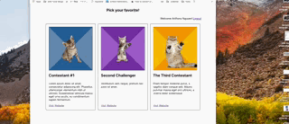
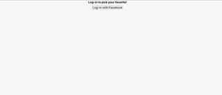

# Telescope-take-home-project
## What is the Telescope-take-home-project?
 > A Mock Voting webiste, this renders a Log out and Log in Page based on a wireframe given to me.

 
 

## Table of Contents

* [Description](#description)
* [Technology Stack](#technology-stack)
* [Installation](#installation)
* [Operation](#operation)
* [Testing](#testing)


## Description

After launching the server via npm start.  Enter the server via the default path of localhost:3000 in the browser.  Upon Entering the site you are presented the Logoff page, use the facebook login button to authenticate via facebook.  After successful authentication, you are directed to the login Page.  This where the user would select the contestant of their choice if this was a production application. 

Build with React, the top Parent Component is index.js, which renders out App.js.  App.js renders out the main component of Contestant Render.  Contestant Render uses fetch to make an API call to retrieve the JSON data provided.  This json data is also passed along to the FacebookRender Componenet, which loads an external library to render a facebook login button and passes the Facebook user information after sucessful login back it it's parent for rendering via a prop callback.  ContestantCardData maps out the contestant information via the API passed from it's parent Contestant Render.  

Vanilla CSS formatting was used, mainly with Flexbox to keep the view repsonsive.  When the window is made smaller, flex wrap is used to wrap the content for easier viewing pleasure, this is useful for mobile devices with smaller screens.

## Technology Stack
 * Bootstrapped with Create-React-App
 * This is written with REACT JS
 * CSS with flexbox

## Installation

#### Environment dependencies

#### Clone project
Clone repo from github:
```sh
# run git clone
git clone https://github.com/mochajoe/telescopetakehomeproject.git
```

#### Project dependencies

Install project dependencies for testing:
```sh
# run install script
npm install
```

## Operation

Open index.html
```sh
# Run NPM Start to start server
Default Server should be located on localhost:3000.  Enter this into the browser.
```


